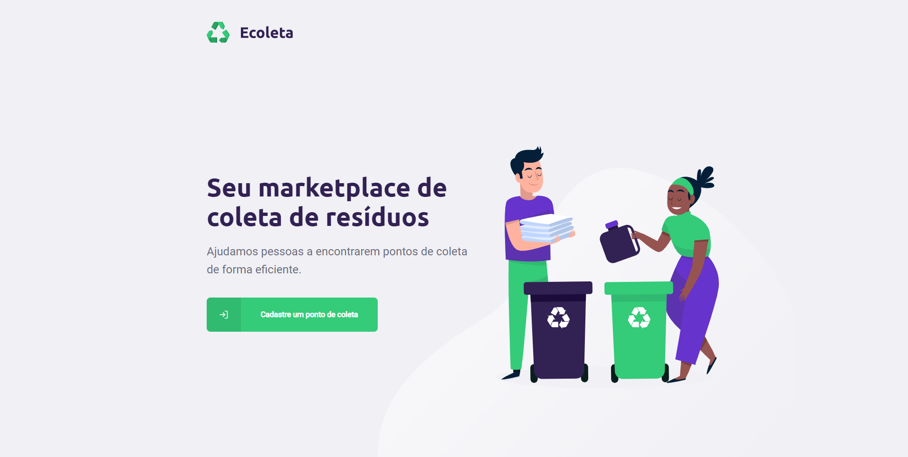

<p align="center">
   
</p>

# Ecoleta ♻

> Find the Nearest Drop-Off Locations

---

<p align="center">
  <a href="https://rocketseat.com.br">
    
  </a>
</p>

<p align="center"></p>
<p align="center"></p>
<p align="center"></p>

---

# :pushpin: Table of Contents

* [Features](#link-features)
* [Used Techs](#rocket-used-techs)
* [Installation](#construction_worker-installation)
* [Getting Started](#checkered_flag-getting-started)
* [Found a bug? Missing a specific feature?](#hammer-issues)
* [License](#book-license)


# :link: Features

* 📝 Register new drop-off locations.
* 🔍 Search for the nearest drop-off location.
* 💻 Connect recycling locations to citizens.

# :rocket: Used Techs

* <a href="https://www.typescriptlang.org/">Typescript</a>

* <a href="https://nodejs.org/en/">NodeJs</a>

* <a href="https://reactjs.org/">ReactJs</a>

* <a href="https://reactnative.dev/">React Native</a>

# :construction_worker: Installation

**You need to install [Node.js](https://nodejs.org/en/download/). In order to clone the project via HTTPS, run this command:**

```git clone https://github.com/GustavoDevOm/ecoleta-nlw-1.git```

SSH URLs provide access to a Git repository via SSH, a secure protocol. If you have a SSH key registered in your Github account, clone the project using this command:

```git clone git@github.com:GustavoDevOm/ecoleta-nlw-1.git```

**Install dependencies**

```yarn``` or ```npm install```

# :checkered_flag: Getting Started

Run the following command in order to start the application in a development environment:

**Backend Initialization**

```yarn dev``` or ```npm run dev```

**Frontend Initialization**

```yarn start``` or ```npm start```

**Mobile Initialization**

```yarn start``` or ```expo start```

# :hammer: Issues

Feel free to **file a new issue** with a respective title and description on the [Ecoleta](https://github.com/GustavoDevOm/ecoleta-nlw-1/issues) repository. If you already found a solution to your problem, **I would appreciate to review your pull request**!

# :book: License

Released in 2021.
This project is under the [MIT license](LICENSE.md).

<h4 align="center">
  Made with ❤️ by Gustavo Matei (https://github.com/GustavoDevOm) 🚀
</h4>
